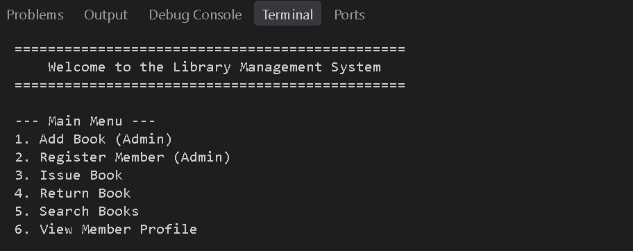
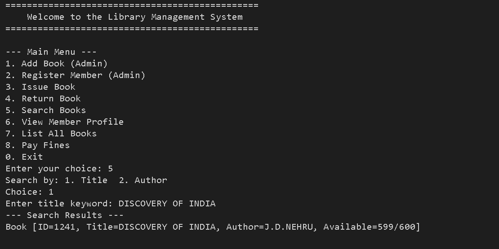
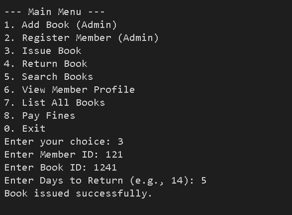

# Console-Based Library Management System

## Overview
This is a pure Java (JDK 11+) console-based Library Management System. It allows librarians (admins) to manage books and members, and provides functionality to issue and return books. It automatically calculates fines for late returns. It features a complete Object-Oriented design without relying on any external database, relying instead on local file serialization for data persistence.

## Features
- **Book Management:** Add, search (by title/author), and list books. Books keep track of total and available copies.
- **Member Management:** Register new members, view member profiles including pending fines and borrowing history.
- **Issue/Return Module:** Issue books to members with a specified return period. Return books and automatically calculate late fines (using a static fine rate). Members with unpaid fines cannot borrow new books.
- **Security:** Simple authentication for Admin actions (default password: `admin123`).
- **Data Persistence:** Automatically saves library state to `library_data.ser` upon any modification and loads it on startup.

## Tech Stack
- **Language:** Java (JDK 11 or higher recommended)
- **Dependencies:** None (Pure Java Standard Library)

## Installation & Running

Ensure you have the JDK installed and added to your system path.

1. Open your terminal/command prompt.
2. Navigate to the `src` directory of the project:
   ```bash
   cd src
   ```
3. Compile all the Java files:
   ```bash
   javac model/*.java service/*.java exception/*.java util/*.java Main.java
   ```
4. Run the application:
   ```bash
   java Main
   ```

## Testing Instructions
Basic JUnit 4 test files are provided in the `test/` directory. To run them from the terminal, you need to have the `junit` and `hamcrest-core` jars in your classpath.
Assuming you have `junit-4.13.2.jar` and `hamcrest-core-1.3.jar` in a `lib` folder parallel to `src`:

```bash
# Compile tests
javac -cp ".;../lib/junit-4.13.2.jar;../lib/hamcrest-core-1.3.jar" ../test/service/*.java service/*.java model/*.java exception/*.java util/*.java

# Run tests
java -cp ".;../lib/junit-4.13.2.jar;../lib/hamcrest-core-1.3.jar;../test" org.junit.runner.JUnitCore service.FineCalculatorTest service.LibraryServiceTest
```
*(If you are on Linux/Mac, replace the semicolons `;` with colons `:` in the `-cp` argument).*

## Screenshots

### Main Menu



### Search Results



### Issue Book



